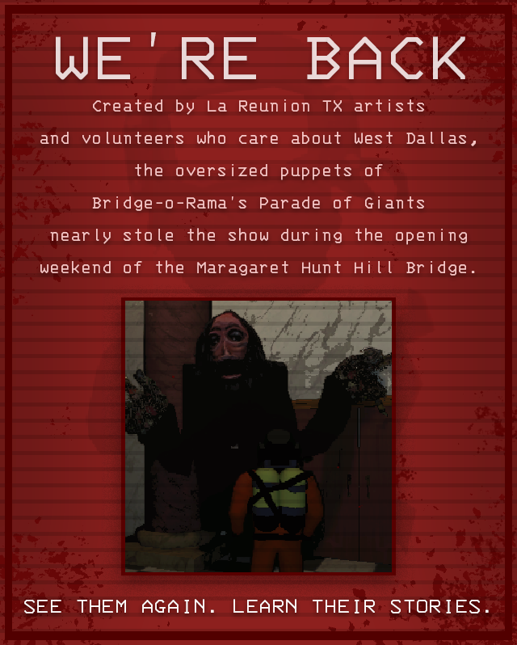

# Rolling Giant

> Made by Andrew Burke

Adds the Rolling Giant as a new enemy type into Lethal Company. Sounds are included.

Features:

- Adds the Rolling Giant as a new enemy
- Adds a custom scrap poster for the Rolling Giant
- Rolling Giants can be scanned to read their own unique bestiary entry
- Multiple AI behaviours to choose from
- Can change the scale of the Rolling Giant between two values
- Can change the Rolling Giant's movement speed, wait durations, move durations, and more
- Rolling Giants have the option to rotate to face the player if they have been still for some time
- Can change the AI type of all Rolling Giants on the fly:
  - A hot key to reload the entire config file
  - Hotkeys to cycle between AI types

## Installation

Put the `/BepInEx/` folder inside your `/steamapps/common/Lethal Company/` folder after installing all the dependencies.

## Config

Generated after launching the game for the first time.

### General

- `GiantScaleMin` - The minimum scale of the Rolling Giant's model
  - This changes how small the Giant can be
- `GiantScaleMax` - The maximum scale of the Rolling Giant's model
  - This changes how big the Giant can be

### Spawn Conditions

These do not update when reloading the config in-game!

- `SpawnIn` - Levels that the Rolling Giant can spawn in, separated by their chances of spawning
  - Vanilla caps at 100, but you can go farther.
  - This chance is also a weight, not a percentage
  - Higher chance = higher chance to get picked
  - The names are what you see in the terminal
  - `Vow:45,March:45,Rend:54,Dine:65,Offense:45,Titan:65`
- `CanSpawnInside` - If the Rolling Giant should spawn inside the dungeon
- `CanSpawnOutside` - If the Rolling Giant should spawn outside
- `DisableOutsideAtNight` - If the Rolling Giant will turn off if it is outside at night.
- `SpawnPosterIn` - Where the Rolling Giant poster scrap can spawn, separated by their chances of spawning
  - Vanilla caps at 100, but you can go farther.
  - This chance is also a weight, not a percentage
  - Higher chance = higher chance to get picked
  - The names are what you see in the terminal
  - `Vow:12,March:12,Rend:12,Dine:12,Offense:12,Titan:12`

### AI

- `AiType` - Type of AI the Rolling Giant uses
  - Coilhead - Move when the player is not looking at it
  - MoveWhenLooking - Move when the player is looking at it
  - RandomlyMoveWhileLooking - Randomly move while the player is looking at it
    - `WaitTimeMin` - The minimum duration in seconds that the Rolling Giant waits before moving again
    - `WaitTimeMax` - The maximum duration in seconds that the Rolling Giant waits before moving again
    - `RandomMoveTimeMin` - The minimum duration in seconds that the Rolling Giant moves toward the player
    - `RandomMoveTimeMax` - The maximum duration in seconds that the Rolling Giant moves toward the player
  - LookingTooLongKeepsAgro - If the player looks at it for too long it doesn't stop chasing
    - `LookTimeBeforeAgro` - How long the player can look at the Rolling Giant before it starts chasing.
  - FollowOnceAgro - Once the player is noticed, the Rolling Giant will follow the player constantly
  - OnceSeenAgroAfterTimer - Once the player sees the Rolling Giant, it will agro after a timer
    - `WaitTimeMin` - The minimum duration in seconds that the Rolling Giant waits before chasing the player
    - `WaitTimeMax` - The minimum duration in seconds that the Rolling Giant waits before chasing the player
- `MoveSpeed` - Speed of the Rolling Giant's movement in m/s²
- `MoveAcceleration` - How long it takes the Rolling Giant to get to its movement speed in seconds
- `MoveDeceleration` - How long it takes the Rolling Giant to stop moving in seconds
- `RotateToLookAtPlayer` - If the Rolling Giant should rotate to face the player if it has been still for some time
- `DelayBeforeLookingAtPlayer` - The delay before the Rolling Giant looks at the player
- `LookAtPlayerDuration` - The duration the Rolling Giant takes to look at the player

### Host

These do not update when reloading the config in-game!

- `GotoPreviousAiTypeKey` - The key to go to the previous AI type
  - This uses Unity's New Input System's key-bind names
  - Defaults to `Keypad 7`
- `GotoNextAiTypeKey` - The key to go to the next AI type
  - This uses Unity's New Input System's key-bind names
  - Defaults to `Keypad 8`
- `ReloadConfigKey` - The key to reload the config. Does not update spawn conditions
  - This uses Unity's New Input System's key-bind names
  - Defaults to `Keypad 9`

## Changelog

## 2.1.3

- Slightly increases the now too low default poster spawn weight

## 2.1.2

- Removed a multipler that was applied to the poster rarity for some reason

## 2.1.1

- Removed the soft dependency to LethalSettings, as it somehow broke through a try catch which broke the mod loading.
- Increased the default spawn weights slightly.
- Added a slight probability curve to the giant's spawning inside, outside, and outside during the day.
  - Inside will slightly more common at the start
  - Outside will be slightly more common at the start and a bit more common near the end
  - Outside during the day will be slightly more common at the start

## 2.1.0

- Renamed `SpawnInside` to `CanSpawnInside`, and is now just a toggle
- Renamed `SpawnOutside` to `CanSpawnOutside`, and is now just a toggle
- Renamed `SpawnDaytime` to `DisableOutsideAtNight` as it was too confusing for many people, and is now just a toggle
- Added extra notes to various config options to make them more clear
- Added the Rolling Giant to the in-game dev enemy spawn list
- Fixed the Rolling Giant's outside AI
- Gave the Rolling Giant, when it is a daytime type, a disabled state

## 2.0.1

- Removed logs from ai modes that spammed the console :(

## 2.0.0

- Removed Terminal API dependency
- Converted the Rolling Giant into a completely custom enemy that can be added to the spawn pools 
- Overhauled all AI behaviors
- Fixed many audio and networking sync issues
- All AI types will wander by default if all players get out of range
- Added a new player death type for when the Rolling Giant kills the player
- Removed wander settings
- Added config options:
  - `GotoPreviousAiTypeKey` - The key to go to the previous AI type.
    - This uses Unity's New Input System's key-bind names
  - `GotoNextAiTypeKey` - The key to go to the next AI type.
    - This uses Unity's New Input System's key-bind names
  - `ReloadConfigKey` - The key to reload the config. Does not update spawn conditions.
    - This uses Unity's New Input System's key-bind names
  - `SpawnIn` - Levels that the Rolling Giant can spawn in, separated by their chances of spawning
  - `SpawnInside` - If the Rolling Giant should spawn inside the dungeon
  - `SpawnDaytime` - If the Rolling Giant should spawn during the day
  - `SpawnOutside` - If the Rolling Giant should spawn outside
  - `MoveDeceleration` - How long it takes the Rolling Giant to stop moving in seconds
  - `SpawnPosterIn` - Where the Rolling Giant poster scrap can spawn, separated by their chances of spawning

## 1.2.0

- Removed unused LC_API dependency
- Added a config option to tell the Rolling Giant to wander again if the player goes past a certain distance
- Added a config option to change that distance between the player and the Rolling Giant
- Added a config option to change how long it takes the Rolling Giant to get to its movement speed
- Added a config option to change the Rolling Giant's visual scale between two values
- Added a config option to change the duration the player has to look at the Rolling Giant before agro for the LookingTooLongKeepsAgro AI
- Audio volume scales based on the Rolling Giant's speed up to a cap of 1.0
- Added new AI types for the Rolling Giant:
  - FollowOnceAgro = Once provoked, the Rolling Giant will follow the player constantly
  - OnceSeenAgroAfterTimer = Once the player sees the Rolling Giant, it will agro after a timer
- Fixed RandomlyMoveWhileLooking AI not taking into account player viewing for timers
- Fixed movement speed not applying to AI tick loop
- Overhauled all settings to allow for per-AI type settings
  - AI types are now grouped with the data they need
  - Previous settings are removed automatically

## 1.1.1

- Made the Rolling Giant rng utilize the map seed to make results less samey

## 1.1.0

- Multiple AI types for the Rolling Giant:
  - Coilhead = Coilhead AI
  - MoveWhenLooking = Move when player is looking at it
  - RandomlyMoveWhileLooking = Randomly move while the player is looking at it
  - LookingTooLongKeepsAgro = If the player looks at it for too long it doesn't stop chasing
- Can change the scale of the Rolling Giant's model
- Can change the Rolling Giant's movement speed and wait/move random durations
- Rolling Giants have the option to rotate to face the player if they have been still for some time
- Rolling Giant variant is now synced visually across clients

## 1.0.0

- Initial release

## Acknowledgments

- `Ayyobee` for a bunch of online testing and suggestions.

 

