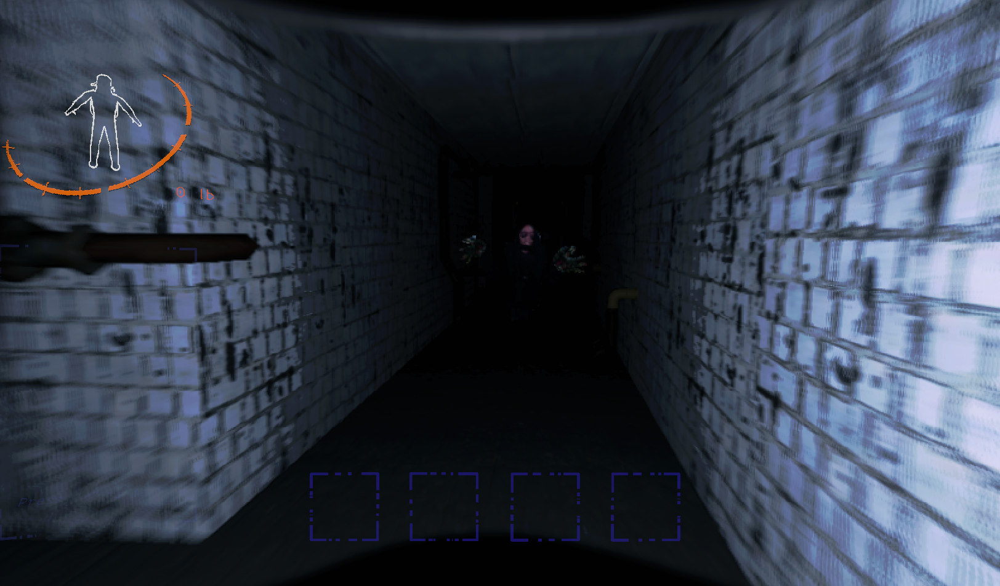
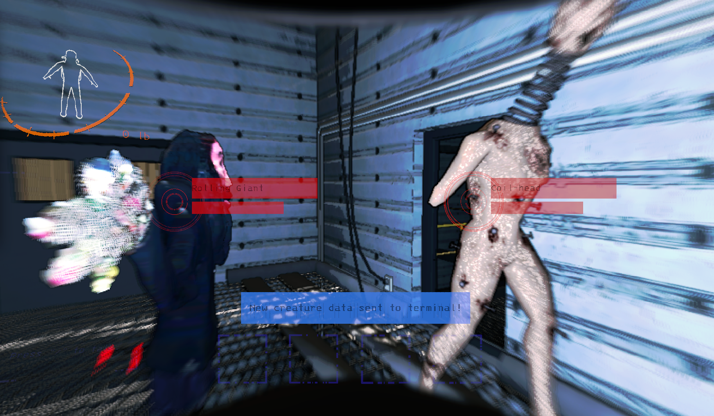

# Rolling Giant

> Made by Andrew Burke

Adds the Rolling Giant as a Coilhead variant into Lethal Company. Sounds are included.

Features:

- Adds a new Coilhead variant into the game with a configurable chance of spawning
- Coilheads and Rolling Giants can co-exist
- Rolling Giants can be scanned to read their own unique bestiary entry
- Rolling Giants have their own scan id so it doesn't conflict with the existing Coilheads

## Installation

Put the `/BepInEx/` folder inside your `/steamapps/common/Lethal Company/` folder after installing all the dependencies.

## Config

Generated after launching the game for the first time.

ChanceForGiant = 0.0-1.0 - Chance for a Rolling Giant to spawn. Higher means more chances for a Rolling Giant.

## Changelog

- 1.0.0 - Initial release

## Send me a Coffee!

